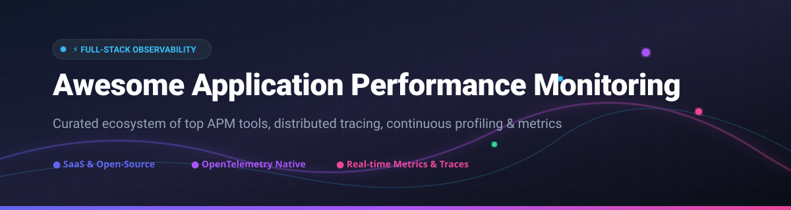

# ⚡ Awesome Application Performance Monitoring (APM) 🚀

  
  
  
  

## 📌 Top Application Performance Monitoring (APM) Tools Ecosystem

**A Curated List of SaaS Platforms & Open-Source GitHub Projects**  
*Focused on Distributed Tracing, Code-Level Profiling, Real-User Monitoring (RUM), and Full-Stack Observability.*  
**Last updated: March 2026**

Welcome to the definitive guide for **Application Performance Monitoring (APM)**, **distributed tracing**, and **cloud-native observability**. This repository tracks leading commercial SaaS platforms and open-source observability frameworks to help engineering teams, Site Reliability Engineers (SREs), and DevOps architects select, compare, and deploy high-performance monitoring stacks.

---

## 📑 Table of Contents
- [🌐 SaaS / Hosted Platforms](#-saas--hosted-platforms)
- [🔓 Open-Source GitHub Projects](#-open-source-github-projects)
- [🛠️ Frameworks for Custom APM Solutions](#%EF%B8%8F-frameworks-for-building-custom-apm-solutions)
- [💖 Support & Sponsorship](#-support--sponsorship)
- [🤝 How to Contribute](#-how-to-contribute)
- [⚖️ Disclaimer](#%EF%B8%8F-disclaimer)
- [📈 Star History](#-star-history)

---

## 🌐 SaaS / Hosted Platforms

> 💡 **Market Size & Structure**: The global Application Performance Monitoring (APM) and Observability market is estimated at **$10.5 Billion+ (2026)** and is projected to surpass **$19 Billion by 2030**. The sector is **moderately fragmented**, with a few dominant mega-cap observability leaders (Datadog, Dynatrace, Cisco AppDynamics, New Relic) coexisting alongside hyper-specialized monitoring platforms.

The following table compares top commercial APM platforms ranked by company scale (revenue/valuation):

| Product 🏢 | Market Scale 📊 | Starting Price 💰 | Free Tier / Trial Limit 🎁 | Key Features & Observability Highlights ⚡ |
| :--- | :--- | :--- | :--- | :--- |
| **[Cisco AppDynamics](https://www.appdynamics.com/)** | **$260B+** (Cisco Parent Market Cap) | $60 / host / month (Infrastructure); $90 / host / month (APM Premium) | 15-day unlimited free trial (reverts to Lite edition) | Business transaction tracing, automated root-cause diagnosis (Cognition Engine), hybrid enterprise & SAP monitoring. |
| **[IBM Instana](https://www.ibm.com/products/instana)** | **$210B+** (IBM Parent Market Cap) | $75 / host / month (billed annually) | 14-day full-featured free trial | AutoProfile™ continuous production profiling, 1-second metric granularity, dynamic dependency mapping. |
| **[Datadog APM](https://www.datadoghq.com/product/apm/)** | **$42B+** (Market Cap) | $31 / host / month (APM & Continuous Profiler) | 14-day full-featured free trial (Free plan available for up to 5 hosts for basic infrastructure metrics) | End-to-end distributed tracing, RUM correlation, Live Tail log integration, AI anomaly detection (Watchdog). |
| **[Dynatrace](https://www.dynatrace.com/platform/application-observability/)** | **$15B+** (Market Cap) | $0.08 / host-hour (8GB host ~$58.40/mo) | 15-day free trial ($300 cloud credit included) | Davis® AI causation engine, automatic topology mapping (Smartscape), native OpenTelemetry ingestion. |
| **[Elastic APM](https://www.elastic.co/observability/application-performance-monitoring)** | **$9B+** (Market Cap) | $95 / month (Elastic Cloud Standard starting tier) | 14-day free trial on Elastic Cloud | Native Kibana dashboards, trace-based sampling, integrated vector search/logs/metrics on OpenSearch/ES. |
| **[SolarWinds APM](https://www.solarwinds.com/observability)** | **$2.5B+** (Market Cap) | $9.90 / host / month (Hybrid Cloud Observability) | 30-day full-featured free trial | Unified cross-domain observability, automated cloud discovery, database performance profiling. |
| **[New Relic APM 360](https://newrelic.com/platform/application-monitoring)** | **$6.5B** (Acquired Valuation by Francisco Partners & TPG) | $0.30 / GB data ingest (Standard Tier, 1st user free) | **100 GB/month forever free** data ingest + 1 full-platform user free | APM 360 full-stack visibility, 780+ integrations, vulnerability management, logs-in-context. |
| **[ManageEngine Applications Manager](https://www.manageengine.com/products/applications_manager/)** | **~$1B** (Zoho Corp Division Revenue) | $995 / year (Professional Edition starting 25 monitors) | **Free Edition forever** (up to 5 applications/servers) or 30-day trial | Byte-code instrumentation for Java, .NET, Node.js, Python, synthetic transaction monitoring. |
| **[Atatus APM](https://www.atatus.com/product/apm/)** | **~$20M** (Estimated Private Valuation) | $0.07 / host / hour (~$49 / host / month) | **Free Forever plan** (14 days data retention, 100K events/mo) + 14-day Pro trial | Flat-rate host pricing, slow DB query analyzer, API endpoint latency tracking, RUM session replay. |
| **[Scout APM](https://scoutapm.com/)** | **~$15M** (Estimated Private Valuation) | $161 / month (Basic Plan includes 400K tracing hours) | 14-day full-featured free trial | Line-of-code visibility, instant N+1 query detection, memory bloat tracking, lightweight developer UI. |

---

## 🔓 Open-Source GitHub Projects

Open-source APM tools empower engineering teams to deploy vendor-neutral instrumentation, self-host telemetry data, and maintain full compliance over sensitive logs, metrics, and distributed traces.

The open-source APM projects below are ranked by **GitHub Stars_Count (Descending)**:

1. **[OpenTelemetry](https://github.com/open-telemetry)** 
     
   ⚡ The CNCF co-maintained global standard for APIs, SDKs, and agents. Provides vendor-neutral telemetry data collection across all major programming languages (Java, Python, Go, Node.js, .NET, Rust, C++).

2. **[Sentry](https://github.com/getsentry/sentry)** 
     
   🐛 Application performance monitoring, transaction tracing, and error tracking platform supporting 100+ environments with self-hosted Docker support.

3. **[Prometheus](https://github.com/prometheus/prometheus)** 
     
   📊 CNCF graduated time-series monitoring service & alert manager engine. The core metric foundation for modern cloud-native APM architecture.

4. **[Grafana](https://github.com/grafana/grafana)** 
     
   📈 The premier open-source analytics & observability visualization platform for metrics, traces, and logs.

5. **[Apache SkyWalking](https://github.com/apache/skywalking)** 
     
   🌌 Application performance monitor designed for microservices, cloud-native, and service-mesh architectures. Features distributed tracing, metrics aggregation, and topology auto-discovery.

6. **[Jaeger](https://github.com/jaegertracing/jaeger)** 
     
   🔍 CNCF graduated end-to-end distributed tracing platform originally created by Uber. Specializes in root cause analysis, trace visualization, and latency profiling.

7. **[SigNoz](https://github.com/SigNoz/signoz)** 
     
   🔥 Open-source full-stack APM native to OpenTelemetry. Integrates traces, metrics, logs, and exceptions in a unified dashboard backed by ClickHouse.

8. **[Pyroscope](https://github.com/grafana/pyroscope)** 
     
   🔥 Open-source continuous profiling platform (part of Grafana Labs) for continuous CPU, memory, and thread profiling with low overhead.

9. **[Pinpoint](https://github.com/pinpoint-apm/pinpoint)** 
     
   📍 Enterprise APM for large-scale distributed Java/PHP/.NET systems created by NAVER. Features real-time topology mapping and bytecode instrumentation.

10. **[Grafana Tempo](https://github.com/grafana/tempo)** 
      
    ⏱️ High-scale, cost-effective distributed tracing backend requiring only object storage (S3/GCS), deeply integrated with Grafana and Prometheus.

11. **[Highlight.io](https://github.com/highlight/highlight)** 
      
    ✨ Full-stack open-source monitoring platform bundling session replay, error stack monitoring, and log management.

12. **[Uptrace](https://github.com/uptrace/uptrace)** 
      
    🚀 Open-source APM tool for OpenTelemetry metrics, traces, and logs, supported by ClickHouse and PostgreSQL.

13. **[GlitchTip](https://gitlab.com/glitchtip/glitchtip)** 
      
    🐞 Open-source, Sentry-compatible error tracking and performance monitoring software lightweight alternative.

14. **[inspectIT (Legacy)](https://github.com/inspectIT/inspectIT)** 
      
    📜 Original open-source APM tool for analyzing Java (EE) applications (referenced for historical context).

15. **[inspectIT Ocelot](https://github.com/inspectIT/inspectit-ocelot)** 
      
    🐆 Zero-code Java agent for capturing application performance metrics and traces via OpenTelemetry.

16. **[SkyWalking Rover](https://github.com/apache/skywalking-rover)** 
      
    🛸 eBPF-based observability agent for Apache SkyWalking providing C/C++/Rust network profiling without code modification.

17. **[etrace](https://github.com/etrace-io/etrace)** 
      
    📉 High-performance distributed tracing and APM tool tailored for large microservice clusters.

18. **[OpenAPM](https://github.com/openapm)** 
      
    📦 Node.js APM wrapper exporting application performance metrics directly to Prometheus endpoints.

---

### 🧱 Additional Open-Source Components & Ecosystem Options
- **[Elastic APM Server](https://github.com/elastic/apm-server)** — Open-source APM server component ingesting telemetry into Elasticsearch.
- **[Micrometer Tracing](https://github.com/micrometer-metrics/tracing)** — Vendor-neutral application observability facade for Spring Boot and JVM applications.
- **[RealOpInsight](https://github.com/realopinsight/realopinsight)** — Operations dashboard for service-level availability and SLA monitoring on Kubernetes.

---

## 🛠️ Frameworks for Building Custom APM Solutions

To build a custom, vendor-neutral APM architecture without software lock-in, combine these core components:
1. **Telemetry Instrumentation**: [OpenTelemetry](https://github.com/open-telemetry) SDKs & Auto-Instrumentation Agents.
2. **Trace Storage & Analysis**: [Jaeger](https://github.com/jaegertracing/jaeger) or [Grafana Tempo](https://github.com/grafana/tempo).
3. **Metrics Store**: [Prometheus](https://github.com/prometheus/prometheus) or VictoriaMetrics.
4. **Log Aggregation**: Grafana Loki or OpenSearch.
5. **Dashboard Visualization**: [Grafana](https://github.com/grafana/grafana).

---

## 💖 Support & Sponsorship

Thank you for visiting and using this Application Performance Monitoring curated resource list! If you find this repository valuable, please consider giving it a ⭐ **Star**, **Forking** it for your team, or sharing it with fellow developers and SREs.

If you'd like to support ongoing maintenance and research, you can sponsor or buy a coffee via the [GitHub Sponsor Dashboard](https://github.com/sponsors/ishandutta2007).

---

## 🤝 How to Contribute

Contributions are welcome! Please read these steps to contribute:
1. Fork the repository.
2. Add your tool under [SaaS](#-saas--hosted-platforms) or [Open-Source](#-open-source-github-projects).
3. Follow table format for SaaS (including exact pricing and scale) or star-badge format for Open-Source.
4. Submit a Pull Request with a short description.

---

## ⚖️ Disclaimer

- This is a **community-curated** list — not exhaustive and not an endorsement.
- All APM products must comply with enterprise data privacy standards (GDPR, HIPAA, CCPA).
- Open-source self-hosted solutions require infrastructure maintenance, proper access management, and security controls.

---

## 📈 Star History

---

  <b>Made with ❤️ for SREs, DevOps Engineers, Platform Teams, and Systems Architects.</b> 
  <i>Let's make application monitoring transparent, observable, and vendor-neutral!</i>

